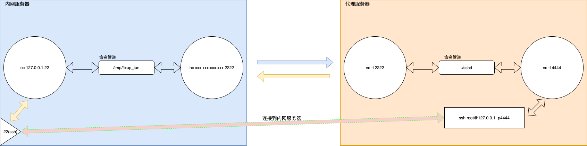

# npf 内网端口转发脚本

使用nc将内网机器的端口反射到公网服务器或者其他服务器上。



程序分为两个脚本，```npf```用于要转发的机器，```npfs```用于接收端口转发请求。

## npf
将本机的端口转发到其他机器

使用：

```bash
# 将本地22端口转发到192.168.1.1的2222端口
$ ./npf 127.0.0.1:22 192.168.1.1:2222
```

## npfs
接收转发请求，脚本监听两个端口，一个端口接收来自客户端的连接，并将数据转发到另一个端口。

使用：
```bash
# 监听2222端口和4444端口，将2222端口数据转发到4444端口
$ ./npfs 2222 4444
```
